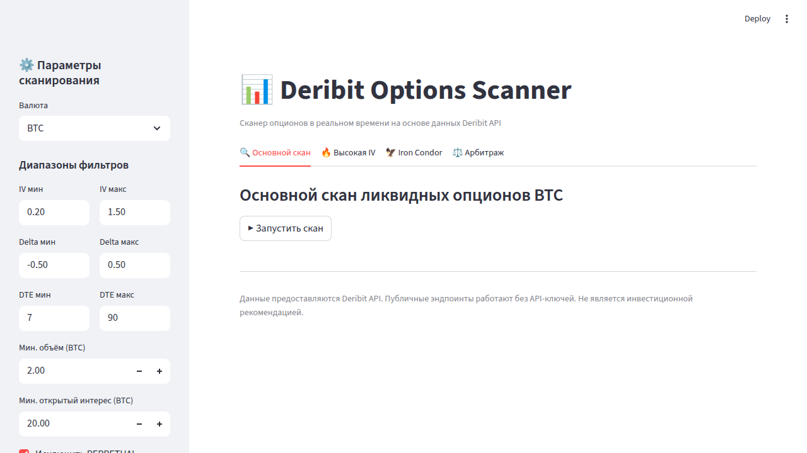

# Option-scan

Сканер опционов для биржи [Deribit](https://www.deribit.com/) (Python).  
Поддерживает фильтрацию по IV, грекам, ликвидности и DTE, а также готовые стратегические сканеры.

## Возможности

| Функция | Описание |
|---|---|
| `scan()` | Основной скан с настраиваемыми фильтрами |
| `scan_high_iv()` | Поиск опционов с высокой IV (продажа волатильности) |
| `scan_iron_condor_setup()` | Поиск сетапов для Iron Condor (30-45 DTE) |
| `scan_arbitrage_opportunities()` | Поиск отклонений Put-Call Parity |
| `export_to_csv()` | Экспорт результатов в CSV |

**Рассчитываемые метрики:** IV, IV Rank, Delta, Gamma, Theta, Vega, DTE, Liquidity Score, Vol/OI Ratio, Moneyness, Spread %.

## Требования

- Python 3.8+
- Публичные эндпоинты работают без API-ключей

## Установка

```bash
pip install -r requirements.txt
```

## Конфигурация

Скопируйте `.env.example` в `.env` и при необходимости заполните ключи (нужны только для приватных эндпоинтов):

```bash
cp .env.example .env
```

## Запуск на Windows

Для пользователей Windows предусмотрены готовые batch-файлы:

1. **Установка** — создаёт виртуальное окружение и устанавливает зависимости:
   ```
   install.bat
   ```

2. **Запуск** — запускает веб-интерфейс через Python из `.venv` (корректно для Windows 10):
   ```
   start.bat
   ```

## Веб-интерфейс

Запустите Streamlit-приложение:

```bash
streamlit run app.py
```

Откроется браузер с полноценным интерфейсом:



### Возможности интерфейса

- **Боковая панель** — настройка фильтров (валюта, IV, Delta, DTE, объём, OI, API-ключи)
- **Основной скан** — ликвидные опционы с таблицей, диаграммами IV vs Liquidity и DTE vs IV
- **Высокая IV** — скан опционов для продажи волатильности с порогом IV Rank
- **Iron Condor** — сетапы с 30–45 DTE и умеренной IV
- **Арбитраж** — отклонения Put-Call Parity с визуализацией
- **Экспорт в CSV** — скачивание результатов любого скана

## Быстрый старт (CLI)

```python
from scanner import DeribitOptionsScanner, OptionFilters

scanner = DeribitOptionsScanner()

# Общий скан ликвидных BTC-опционов
filters = OptionFilters(
    currency="BTC",
    min_volume=2.0,
    min_open_interest=20.0,
    iv_min=0.2,
    iv_max=1.5,
    dte_min=7,
    dte_max=90,
    delta_min=-0.5,
    delta_max=0.5,
)
results = scanner.scan(filters)
print(results.head(10))

# Скан высокой волатильности
high_iv = scanner.scan_high_iv(currency="BTC", iv_threshold=0.85)

# Iron Condor сетапы
ic = scanner.scan_iron_condor_setup(currency="BTC")

# Арбитражные возможности
arb = scanner.scan_arbitrage_opportunities(currency="BTC")
```

Или запустите скрипт напрямую:

```bash
python scanner.py
```

## Тесты

```bash
pytest tests/ -v
```

## Структура проекта

```
Option-scan/
├── app.py              # Streamlit веб-интерфейс
├── scanner.py          # Основной модуль сканера
├── requirements.txt    # Зависимости
├── .env.example        # Пример конфигурации
├── install.bat         # Установка зависимостей (Windows)
├── start.bat           # Запуск приложения (Windows)
├── docs/
│   └── screenshot.png  # Скриншот интерфейса
└── tests/
    └── test_scanner.py # Unit-тесты
```

## Безопасность

- API-ключи хранятся в `.env` (не в коде)
- Публичные данные не требуют аутентификации
- Файл `.env` добавлен в `.gitignore`
